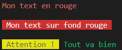

# couleurs dans le terminal

## Avant-propos

Pas besoin d'un fichier HTML, exécutez votre code directement dans le terminal de VS code :

```
node mon-fichier.js
```

## Afficher le texte en couleur dans le terminal

Il est possible d'afficher de la couleur lorsque vous faites de `console.log()`.

Il faut pour cela coller un code spécial devant votre text.

Ce code doit ressembler à ceci :

```javascript
'\u001b[31m'; // texte en rouge
'\u001b[32m'; // texte en vert
```

Ainsi :
```javascript
console.log('\u001b[31m' + 'Mon texte');
```

Affiche le texte "mon texte", en rouge.

Et :

```javascript
console.log('\u001b[32m' + 'Mon texte');
```

Affiche le texte "mon texte", en vert.


Le tableau ci dessus, donne les code couleurs possibles,dans la colonne de gauche "FG" (ForeGround).

Les 8 couleurs de base vont de `30` à `37`;

## RESET

Après avoir utiliser une couleur, il faut toujours remettre le terminal par défaut, faire un reset avec le code `'\u001b[0m'`.

Il aurait donc fallut écrire : 

```javascript
console.log('\u001b[32m' + 'Mon texte' + '\u001b[0m');
```

Pour afficher le texte "mon texte", en vert, et remettre les couleurs par défaut.

## Couleurs d'arrière plan 

Il est aussi possible de changer la couleur de fond avec un code un peu différent :

```javascript
'\u001b[0;41m'; // fond en rouge
'\u001b[0;42m'; // fond en vert
```

Les codes possibles sont aussi dans le tableau, ligne 'BG' (BackGround).

Les 8 couleurs de fond de base vont de `40` à `47`;

## Exercice :

Créez une librarie *"terminal-colors.js"* qui permette de rapidement créer des textes de couleur à utiliser avec `console.log()`, pour colorer le terminal.

**Exemple :**

```javascript
console.log( red('Mon texte en rouge') ) // Affiche du text en rouge
console.log(''); // ligne vide
console.log( redBG(' Mon texte sur fond rouge ') ) // Affiche du text en rouge
console.log(''); // ligne vide
console.log( yellowBG(' Attention ! ') + green(' Tout va bien')) 
// Affiche une ligne avec du fond jaune au début et du text vert ensuite

```

Donne ceci :



Vous devez gérer les 8 couleurs de bases en text et en background. Donc 16 fonctions en tout.

